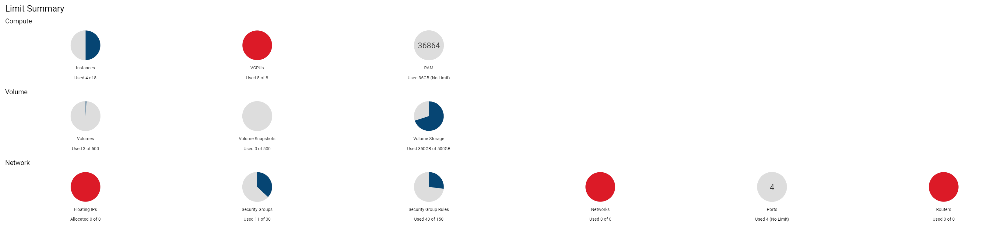

# Australia Social Media Analytics on the Cloud

## Table of Contents
* [Abstract](#abstract)
* [User Guide](#user-guide)
* [System Architecture and Design](#system-architecture-and-design)
* [Developed By](#developed-by)

## Abstract
Our study performed a could-based solution to social media sentiment analysis. We leveraged
the Melbourne Research Cloud for the establishment of instances required for data gathering,
data processing, data administration, and website deployment. We developed Ansible scripts to
support automatic deployment and dynamic scaling of our project. For our analysis scenarios,
we performed Natural Language Processing (NLP) study investing the happiness expressed on
social media in Australia and globally. Scenarios include happiness variations by time, location,
and and influential factors for happiness expressed on social media. Machine learning model was
developed to classify potential reason.

*In this README, it would focus on the user guide and the system design. 
*To gain more details about the data analysis of Australian happiness, please read the attached [report](https://github.com/is0xjh25/social-media-analytics-on-cloud/blob/main/Report.pdf).

## User Guide
In this section, we detail how our project was deployed to the Melbourne Research Cloud (MRC) in a manner that allows for scalablility.
### Deploying Instances
  Since we were unable to create a script to deploy the instances due to issues with OpenStack, and as a result these sections were done manually.
  We created four instances using the snapshot detailed in the following section each with a volume attached that stores the data. The size of these volumes vary depending on the role of the instance.
  
### Configuring Instances
The snapshotted image used in the creation of our running instances ran the following steps:
With the instances that we created, we added unique public and private key pairings for each member of the group during the configuring stage. This was done such that each member can use their own private key to access the instances with the appropriate security implemented. In order to do this, we added an authorised keys file to the `/home/ubuntu/.ssh` directory
Here, we also installed some specific dependencies to the instances in order to have the software run appropriately. We ran general linux updates with sudo apt update and sudo apt-get upgrade.
We then installed docker manually through the following steps:
  1. installing dependencies such as curl, gnupg, ca-certificates and lsb-release
  2. configuring a docker repository
  3. Starting the Docker Daemon
  4. Installing the following packages: docker-ce, docker-ce-cli, containerd.io, docker-compose-plugin After this stage, a snapshot was taken under the name docker installed
On our Ansible master instance, we also installed Ansible with `python3 -m pip install --user Ansible.`

### Dynamic Deployment Using Ansible
In order to run this following section, simply run the code below in the Ansible master instance (instance 1). This code runs each of our Ansible scripts that setup the instances as required to run the `. /home/ubuntu/Ansible/initial-setup.sh`

### Deploying CouchDB
CouchDB is deployed to run on instance one, two and three, with instance three being the master node.
This stage consists of two roles:
  1. CouchDB-setup, this step creates a docker container on each of the machines running CouchDB.
  2. cluster-setup, this step creates a cluster of the CouchDB nodes created in the previous step.

### Deploying Data Crawlers
Deploying the docker instances that held the CouchDB databases is based on the Ansible script(`deploy- twitter-harvester`). The docker container with an image(`jonghop/twitter-docker`) is created and launched on the virtual machine (twitter-harvester) with a CouchDB container. The condition of the twitter harvesting is locating the raw tweets data in volume which attached in the same virtual machine. If it not exists, it will periodically check the file and give warning messages.

### Deploy Back-end Server
The task of deploying back-end server is handled by the Ansible script(`deploy-backend`) when the main Ansible script(`initiate`) is executed. The docker container with an image(`jonghop/flask-docker`) is created and launched on the virtual machine (web-server). The environment file which records COUCH PASSWORD, MASTER NODE, LAST SERVER, THRESHOLD is stored at (`/data/flask-setting`).

### Start Front-end Application
Similar to the process of deploying back-end server, the front-end server would be deployed by the An- sible script(`deploy-frontend`) when the main Ansible script(`initiate`) is executed. The docker container with an image(`jonghop/react-docker`) is created and launched on the virtual machine (web-server). The environment file which records REACT APP BACKEND URL, REACT APP BACKEND URL 2 is stored at (`/data/react-setting`).

## System Architecture and Design
### System Architecture

  

### System Design Considerations

  

### Allocated Resources
We utilise four instances on the Melbourne Research Cloud [1], each of these are built with 2 Virtual CPUs and 9GB of RAM. Meaning that, in total we are using 8VCPUs and 36GB of RAM on the MRC. For our volumes, we used three volumes to store our data. Our CouchDB master instance has a 150GB volume attached, and our other two instances have 100GB volumes attached. This means that
we have 350GB of space used in the MRC for this project.

  

### Instances
- **Instance 1 (mastodon-harvester)** 
Instance 1 is our Ansible master node that calls the dynamic deployment of our project. This instance runs the initial-setup.sh script, which divides the tasks amongst the virtual machines appropriately.This instance contains a node in the CouchDB cluster, which stores its data on the attached volume at  `/volume/CouchDB`. Once the initial setup is complete, Instance 1 is running two Docker containers, one containing a CouchDB node, and the other containing the Mastodon Harvester.

- **Instance 2 (twitter-harvester)** 
Instance 2 has a Docker container that holds a CouchDB node. This node’s volume is attached at `/volume/CouchDB/`. This instance also hosts the Twitter processor. This processor has two tasks, one which gets the raw Twitter data and processes it to a smaller, more usable form. It then has a second task which is to upload the processed data to our CouchDB cluster. When scaling is required for our back-end, this node actually has the capacity to take on an extra Docker container that runs the back-end for our website in order to take some traffic away from our website master instance. It is a simple deployment of a container that runs the Flask back-end of the website, which can then be taken down when the demand for the website is back to a manageable state for the fourth instance.

- **Instance 3 (couchdb-master)** 
Our third instance’s primary responsibility is to be the CouchDB master node. This means that when the CouchDB-setup script and cluster-setup script are run, they are done so from the third instance and the master node Docker container for the CouchDB cluster is on this node. In addition, this instance also has the capacity to take on extra container for the Mastodon harvester.

- **Instance 4 (web-server)** 
The fourth instance in our system is the website instance. When our initial setup script is run, the second last thing it does before running monitoring is deploying the web server. This means setting up the back-end which is coded with Flask, and deploying the front-end which is written with React.

## Developed By
**TEAM 67 :** 
- [Jiahe Liu (1214235)](https://github.com/gracelovesyah) 
- [Jongho Park (1152505)](https://github.com/JP5635) 
- [Benjamin Murdoch (1434075)](https://www.linkedin.com/in/benjamin-murdoch-6256a91b1/) 
- [YongLi Qin (1174036)](https://github.com/YongLi-Qin) 
- [Yun-Chi Hsiao (1074004)](https://is0xjh25.github.io) 

***
*_more details in [project specification](https://github.com/is0xjh25/social-media-analytics-on-cloud/blob/main/Assignment2.pdf) and [report](https://github.com/is0xjh25/social-media-analytics-on-cloud/blob/main/Report.pdf)._
